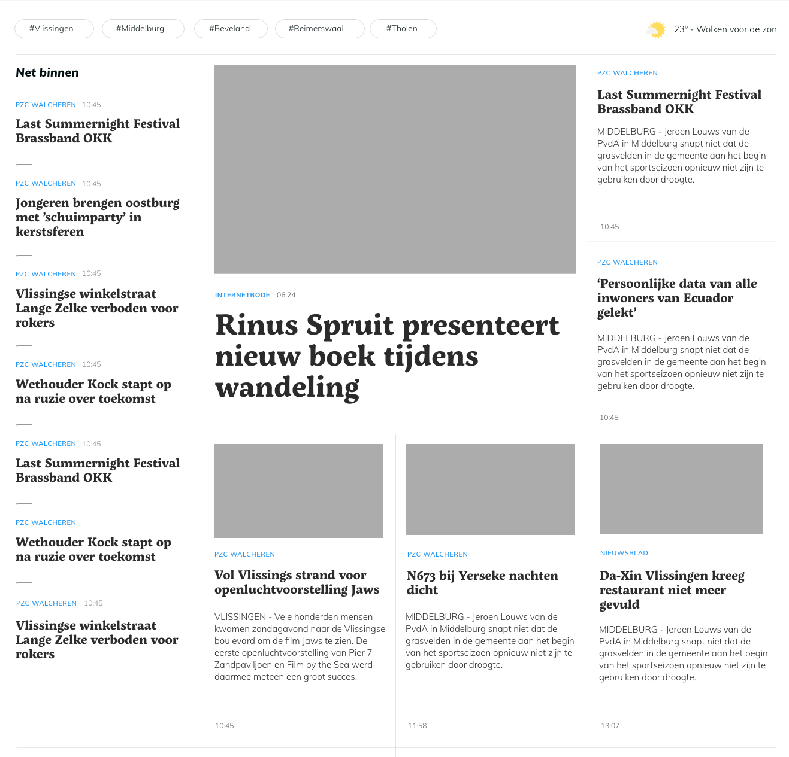

import { Callout } from 'nextra/components'
import HTMLCSSJSPlayground from '../../../../../../components/HTMLCSSJSPlayground';

# When should You Use CSS Grid?
Grid is ideal for when you want the **layout** to determine the positioning of items within a container. 

In other words, you should choose it over Flexbox when you want to create a structured layout that you want to put content into. 

As stated earlier, it is a 2-dimensional layout system. So it can be useful when you want to create more complex layouts that require **both** rows and columns.

Here are some scenarios where that might be what you want:

- **Two-Dimensional Page Layouts**: Grid is perfect for creating complex web page layouts that require both rows and columns, such as a site with a header, sidebar, main content area, and footer.

<HTMLCSSJSPlayground folderPath={"CSS/Layout/Grid/WhenToUseGrid/TwoDimensionalPageLayout"} />

- **Magazine or Newspaper Layouts**: Grid allows for precise placement of articles, images, and advertisements in a structured format.

- **Image Galleries with Uniform Sizes**: When you want images to align perfectly in a grid format, regardless of their individual dimensions.

<HTMLCSSJSPlayground folderPath={"CSS/Layout/Grid/WhenToUseGrid/ImageGallery"} />

- **Dashboard Layouts**: Grid is great for arranging various widgets and components in a structured manner, allowing for easy resizing and repositioning.

- **Overlapping Elements**: Grid allows for layering and overlapping of items within the same grid area, which can be useful for certain design effects.

<HTMLCSSJSPlayground folderPath={"CSS/Layout/Grid/WhenToUseGrid/OverlappingElements"} />

<Callout type="info">
    Remember that you can both use Flexbox and Grid together in the same project! Looking through the scenarios above, you might find that some parts of your layout are better suited to Flexbox while others are better suited to Grid.
</Callout>
