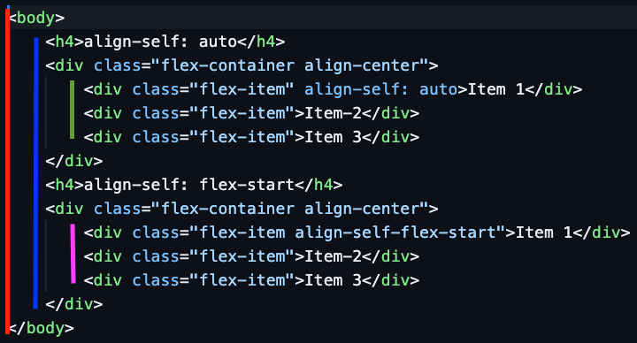
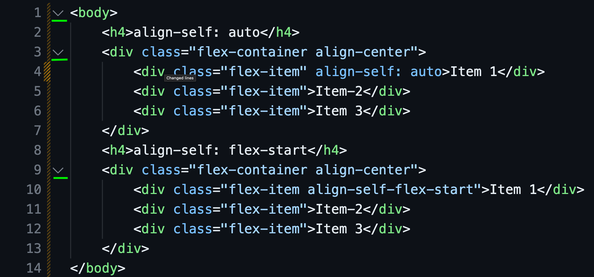

import HTMLTree from '../../../assets/vectors/HTMLTree.svg';
import HTMLTreeWithLabels from '../../../assets/vectors/HTMLTreeWithLabels.svg';
import { Callout } from 'nextra/components';

# The Document Object Model (DOM)

The Document Object Model (DOM) is a programming interface for web documents. It represents the structure of an HTML document (a page) as a tree of objects.
This allows programming languages like JavaScript to interact with and manipulate the content, structure, and style of web pages dynamically.

## Tree Structure Example
Consider the following simple HTML document:
```html
<!DOCTYPE html>
<html>
<head>
    <title>Sample Page</title>
</head>
<body>
    <h1>Hello, World!</h1>
    <p>This is a sample paragraph.</p>
</body>
</html>
```
In this example, the DOM tree structure would look like this:
```
- Document
  - html
    - head      
      - title
        - "Sample Page"
    - body
        - h1
            - "Hello, World!"
        - p
            - "This is a sample paragraph."
```

<HTMLTree alt="HTML Tree" className="w-full h-auto object-contain" style={{margin: '2em 0'}}/>

Each level of indentation represents a parent-child relationship between elements. The `Document` is the root node (think of it as the oldest ancestor -- ie. your great-great-grandmother), and all other elements are its descendants.
Think of the text content within the title as you and your cousins.

If we wanted to represent this same tree using that family metaphor, it would look something like this:
```- Great-Great-Grandparent (Document)
  - Great-Grandparent (html)
    - Grandparent (head)
      - Parent (title)
        - You ( "Sample Page" )
    - Grandparent (body)
        - Your Aunt/Uncle (h1)  
            - Cousin ( "Hello, World!" )
        - Your Aunt/Uncle (p)
            - Cousin ( "This is a sample paragraph." )
```

<HTMLTreeWithLabels alt="HTML Tree with Family Labels" className="w-full h-auto object-contain" style={{margin: '2em 0'}}/>

The way this differs from a traditional family tree is that in the DOM tree, each element can have **multiple children** (like how a parent can have multiple kids), but each child can only have **one parent** (you only have one mom or one dad, not both).


## Why is understanding the DOM Tree Important?

Understanding the DOM tree and the parent-child relationships between elements is crucial for web development because:

- **Writing HTML**: Knowing where elements should be placed within the DOM tree helps in writing well-structured HTML documents. Proper nesting of elements ensures that the webpage renders correctly and is accessible.
- **CSS Styling**: Understanding the DOM tree structure allows you to use selectors that rely on parent-child relationships to apply styles to specific elements. This will save you time and effort when writing CSS.
- **Manipulating Content with JavaScript**: JavaScript can be used to dynamically change the content of a webpage by targeting specific elements in the DOM tree. Many times you'll need to navigate up or down the "branches" of the tree to find the right element to modify.

## Tips for Understanding the DOM Tree in your Code Editor

When working with HTML in your code editor, consider the following tips:

1. **Indentation**: Indentation, as shown in the examples above, is a direct representation of the DOM tree structure. Each level of indentation indicates child elements nested within its parent element. If it helps think of an imaginary line going down the left side of your code -- every time you see an opening tag that is indented further to the right than the previous line, it means you're going deeper into the tree.



In the example above, each line indicates a new level in the DOM tree and indicates which elements are sibling elements - elements that share the same line:

- 🔴: `body` = grandparent
- 🔵: `h4`s and `div`s (with class `flex-container`) = parents
- 🟢: `div`s ( with class `flex-item`) = children
- 🟪: `div`s (inside second `flex-container`) = children 

<Callout type="default" title="Tip"> 
  If you right click in your code editor, you may find an option to "Format Document" or "Auto-Indent" which can help you maintain proper indentation.
  
  It will also help show you where you might have forgotten to close a tag, as the indentation will look off.
</Callout>

2. **Folding Sections**: Many code editors allow you to fold sections of code. This feature can help you visualize the DOM tree by collapsing **child elements** under their **parent elements**. Look for small arrows or plus/minus icons next to opening tags that allow you to collapse or expand sections of your HTML code.

